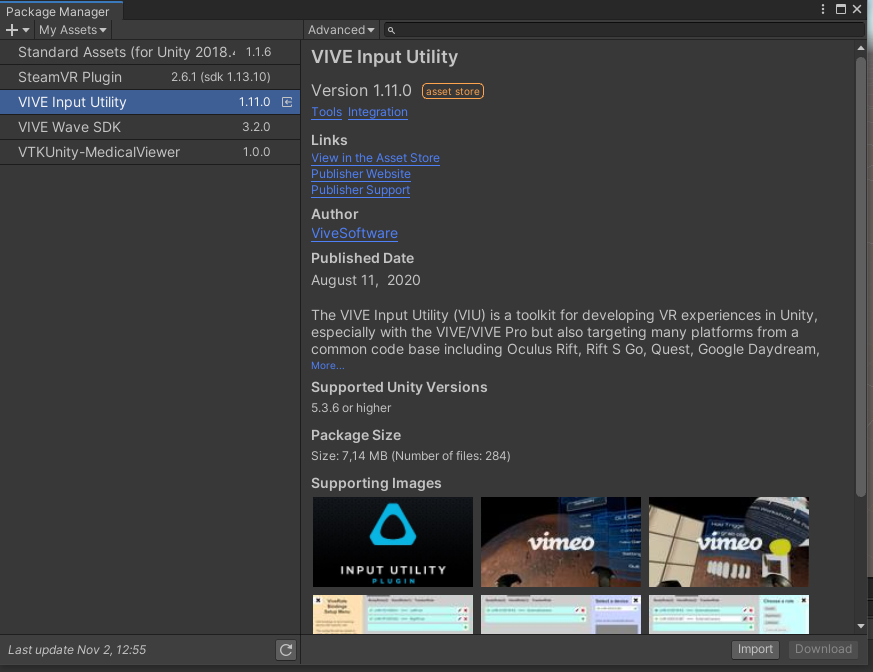
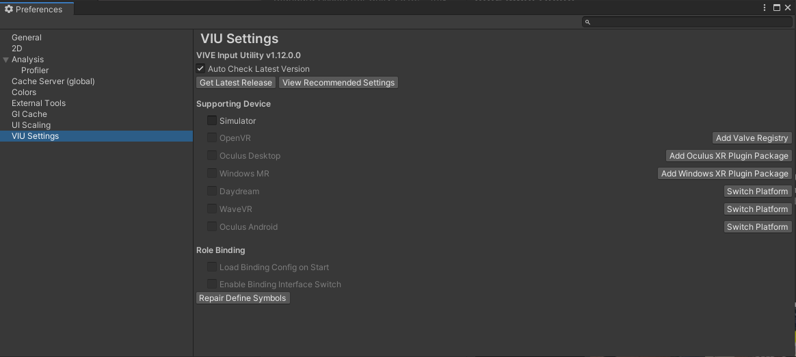
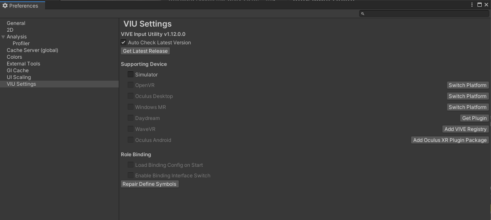
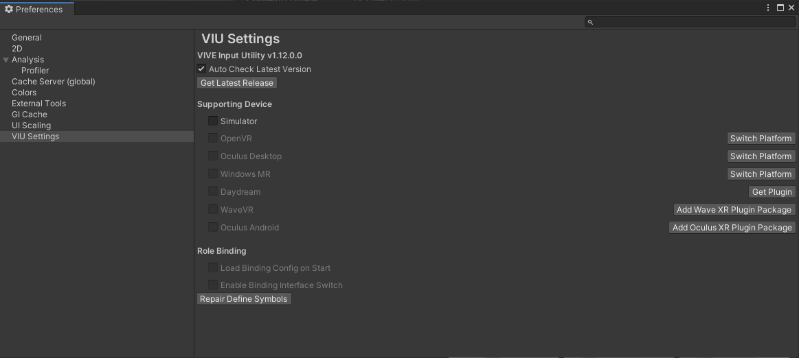
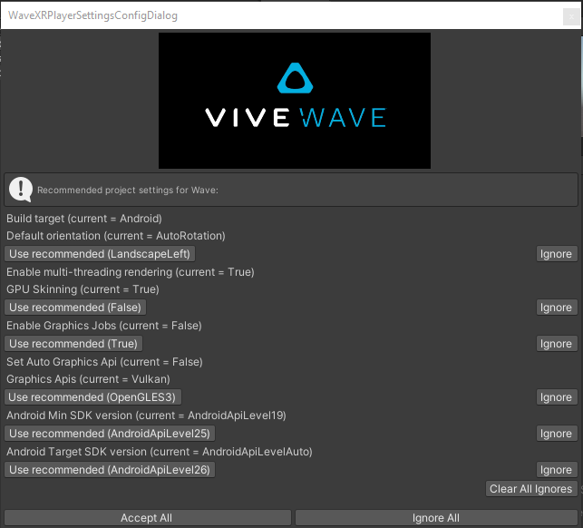
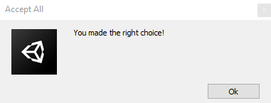
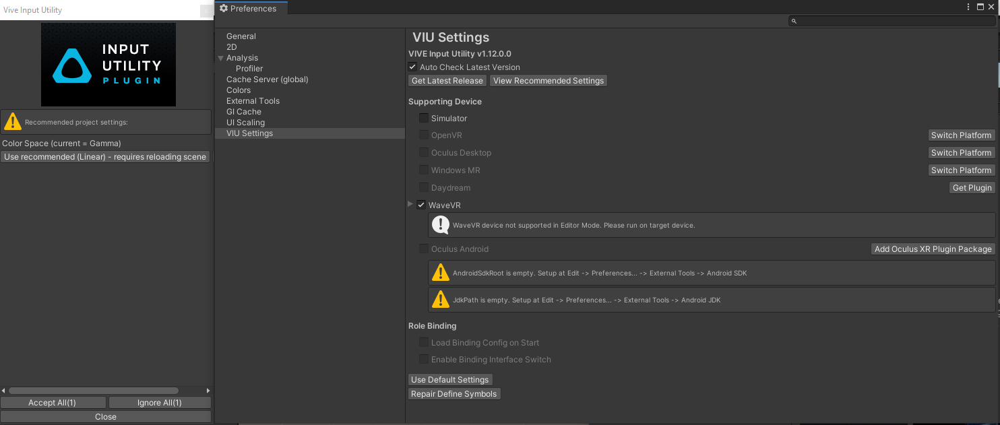
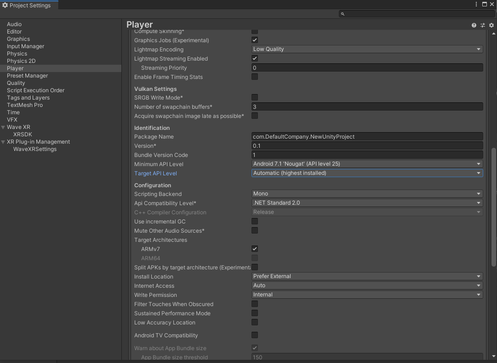
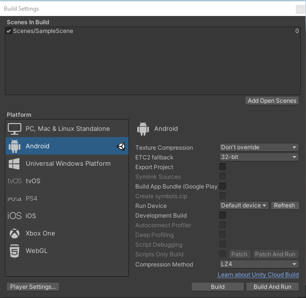

# Setup  des Androidbuilds für die HTC Vive Focus Plus mit WaveVR und ViveInputUtility in Unity™ 

VIU über den PackageManager installieren

In den Einstellungen unter VIU
SwitchPlatform bei Wave-VR anklicken

Danach "Add VIVE Registry" auswählen

Im Folgenden WaveXR Plugin Package installieren

Im Popupfenster "Accept All" anklicken

Auf "OK" klicken

In den Einstellungen WaveVR aktivieren und folgendes Popupfenster bestätigen

In den ProjectSettings unter "Player"  bei Target API Level "Automatic" auswählen

In den Build Settings die Szene hinzufügen und bauen
