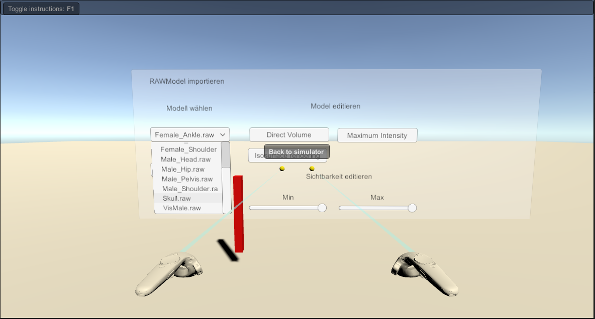
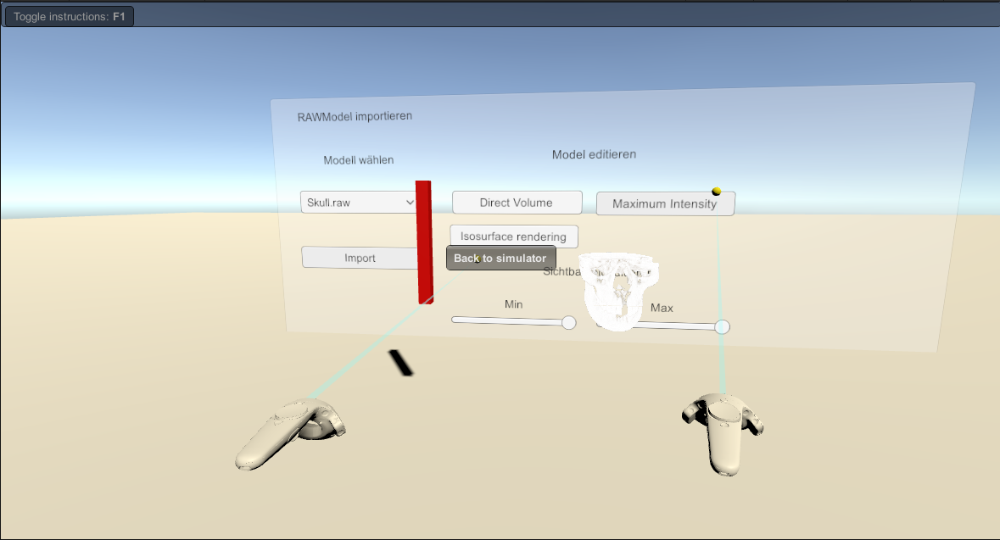
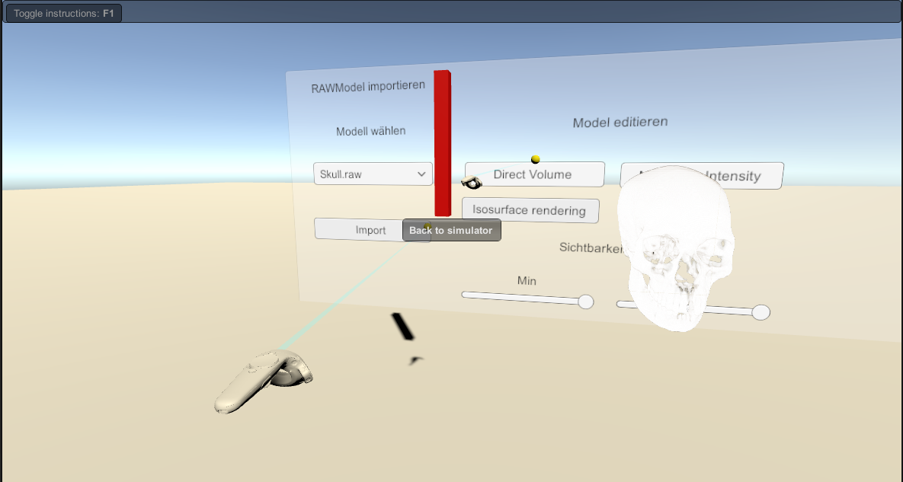
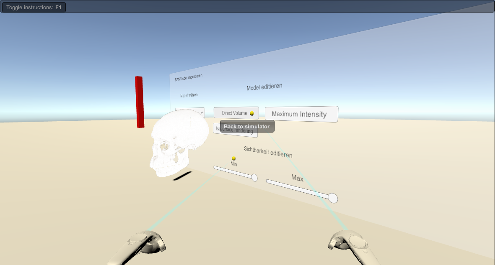
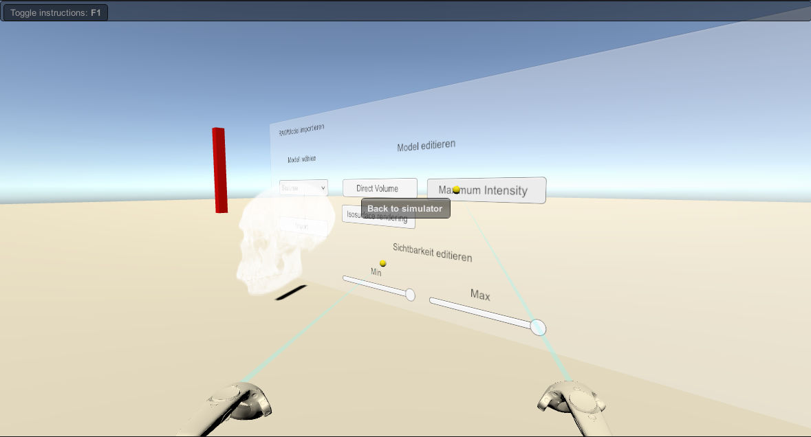
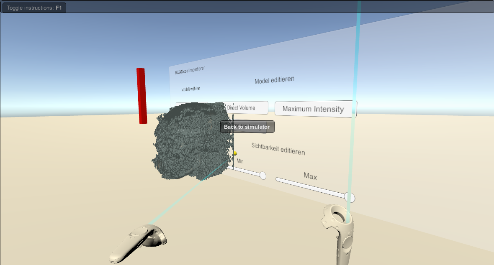
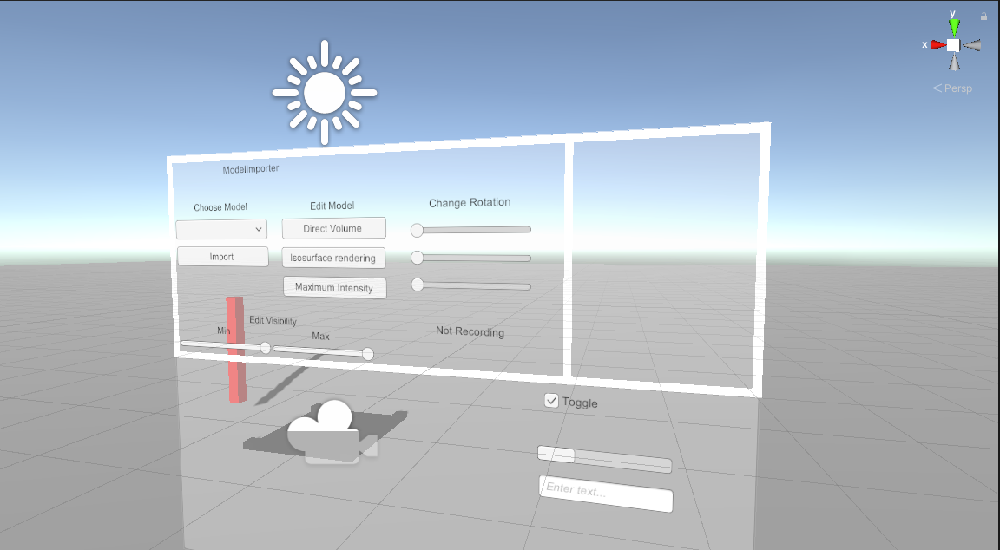
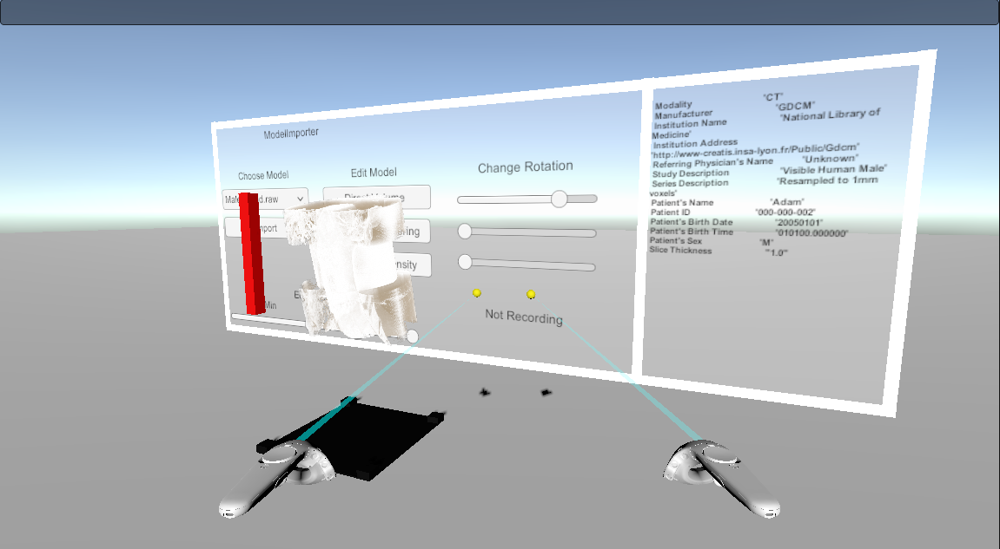
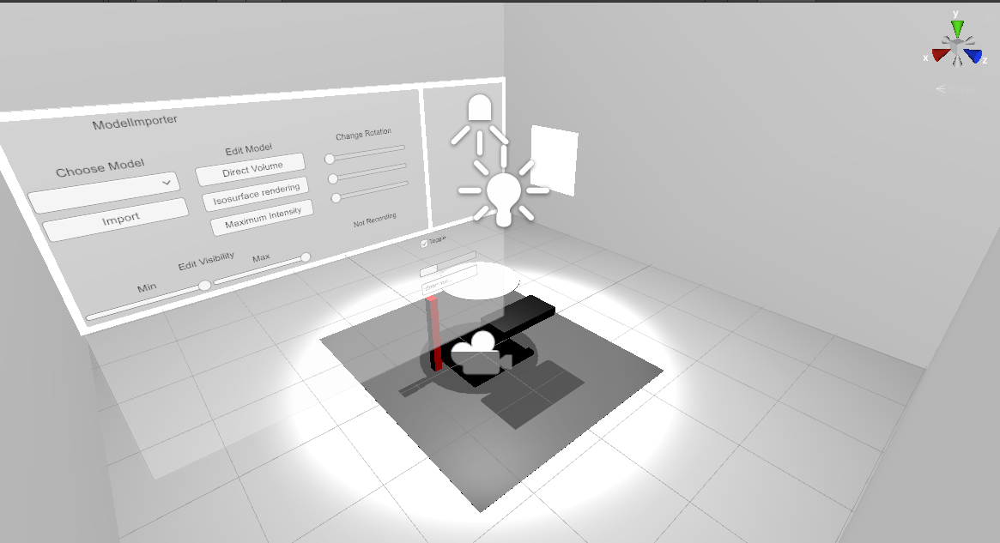
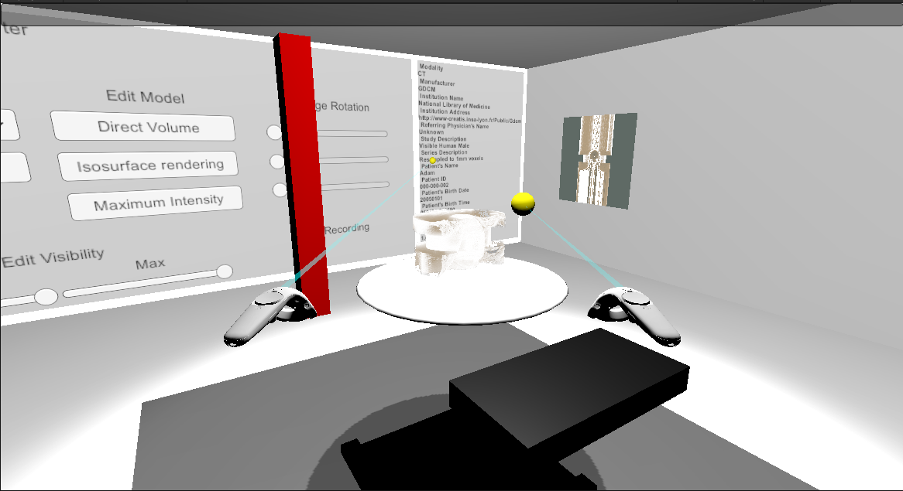

# Immersive Volume Graphics
VR and AR applications using volume graphics.

Used technologies:
- Unity with HLSL
- VTK

# German Version, see English Version below

## Grundidee:

Dabei geht es um die Frage, wie Mediziner medizinische Daten (zum Beispiel 3D-Modelle von Gewebe , CT-Bilder ) visuell in Virtuell Reality verarbeiten. Eine Umsetzung dieser Idee könnte eine potenzielle Erleichterung der Arbeitsweise im medizinischen Umfeld schaffen. Konkret sollen durch Techniken aus dem Bereich der Computergrafik und ggf. Bildverarbeitung Volumen gerendert werden und an ein VR-fähiges Geräte gesendet werden. Verschiedene Anwendungsfälle (,,Use Cases") sollen dabei  umgesetzt werden : Betrachtung der Daten/Modelle z.B. im Sitzen am Schreibtisch oder im Stehen.

Allgemein ist die Arbeit angelehnt an die Projektideen aus http://webhome.hs-kl.de/~brill/Projekte.html unter dem Stichpunkt Immersive VTK. 

Das Projekt gliedert sich in folgende Bestandteile:

## Einarbeitungsphase:

- Einarbeiten in Volumendaten 
- Einarbeiten in Volumengrafik 
- Einblick auf die Verwendung von Shadern 
- Einarbeiten in VTK

-Einarbeitung in OpenVR-Bibliotheken

-Einarbeitung in medizinische Daten und Modalitäten ( DICOM-Format , CT-Aufnahmen usw.) 

## Hauptphase und Umsetzung:

- Verbindung des gesammelten Wissens aus den  Bereichen Medizin, Computergrafik und Informatik. 

- Einlesen der Daten und evtl. Verarbeitung

- Rendern von Volumen/Bildern ( unter Nutzung von Shadern) und  Interaktionselementen

- Eventuelles Post-Processing

- Realisierung der Visualisierung als VR-Anwendung

- Simulation der Anwendungsfälle in VR

- Erstellung einer Pipeline

## Nach der Hauptphase (optional):

- Testen der Anwendung durch Sichtung von medizinischem Fachpersonal.

- Optimierung

  

# English 

## Basic idea:

It is about the question of how medical professionals process medical data (e.g. 3D models of tissue, CT images) visually in virtual reality. Implementation of this idea could potentially make work easier in the medical environment. Specifically, using techniques from the field of computer graphics and possibly image processing, volumes should be rendered and sent to a VR-capable device. Different use cases should be implemented: Consideration of the data / models e.g. sitting at the desk or standing.

In general, the work is based on the project ideas from http://webhome.hs-kl.de/~brill/Projekte.html under the heading Immersive VTK.

The project is divided into the following components:

## Induction phase:

- Incorporation into volume data
- Incorporation into volume graphics
- Insights into the use of shaders
- Familiarization with VTK

- Familiarization with OpenVR libraries

- Familiarization with medical data and modalities (DICOM format, CT images, etc.)

## Main phase and implementation:

- Combination of the accumulated knowledge from the fields of medicine, computer graphics and IT.

- Reading in the data and possibly processing

- Rendering of volumes / images (using shaders) and interaction elements

- Any post-processing

- Realization of the visualization as a VR application

- Simulation of the use cases in VR

- Creation of a pipeline

## After the main phase (optional):

- Testing the application through screening by healthcare professionals.

- Optimization

## Screenshots (Basic examples in VR) 

##  Feature List (so far)

- Automated converting of DICOM-Files into RAW-File using ImageJ
- Automated extracting of DICOM Metainformation eg. patient´s name , modality etc.
- Dictation function ( speech to text) 
- Voice commands in Unity 
- VR-enabled volume rendering 
- Creating a VR-based user experience 

## Update 1

## Update 2

